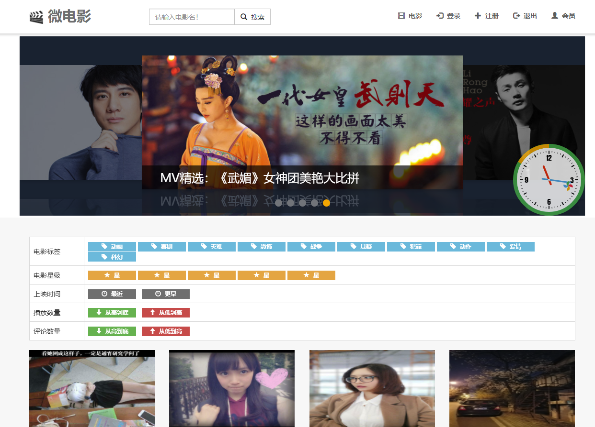
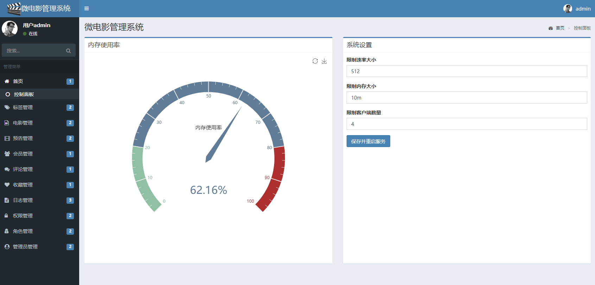

一个以 SSM 作为框架搭建的微电影管理系统。

## 关于项目

* 项目是一个微电影管理系统，分为前后端
* 使用 Maven 构建
* 后台使用 SSM + Admin LTE 搭建
* 前端使用 Bootstrap 搭建

## 功能介绍

* 后台管理系统
* 电影列表
* 标签
* 评论
* 播放
* 等功能

## 使用步骤

* Java
* MySQL 5.x
* Spring 4.x
* SpringMVC 4.x
* MyBatis 3.x
* 其他依赖看 pom.xml 即可

## 克隆项目到本地

使用如下命令讲项目克隆到本地：

```
git@github.com:ikutarian/ssm-movie.git
```

## 数据库初始化

数据库初始化语句在 `movie.sql` 文件中。只需要执行

```sql
source movie.sql
```

即可导入数据库。

接着，打开 `jdbc.properties`，根据本地环境修改数据库的配置信息

```
jdbc.driver=com.mysql.jdbc.Driver
jdbc.url=jdbc:mysql://localhost:3306/movie?useUnicode=true&characterEncoding=utf8
jdbc.username=root
jdbc.password=
```

## 配置文件存放目录

根据自己的系统，修改图片、电影、预告的文件存放位置

```
imageBasePath=E:\\project\\movie_file\\img\\
movieBasePath=E:\\project\\movie_file\\movie\\
previewBasePath=E:\\project\\movie_file\\preview\\
```

## 运行项目

使用 Tomcat 运行项目

## 打开浏览器查看项目运行效果

在浏览器中输入 localhost:8080/movie/ 即可查看项目的运行效果

## 要进入后台管理系统

在浏览器中输入 localhost:8080/movie/admin/index，账号密码分别是：admin 和 1

## 截图

前台



后台



## 反馈

有任何问题可以提交 issues